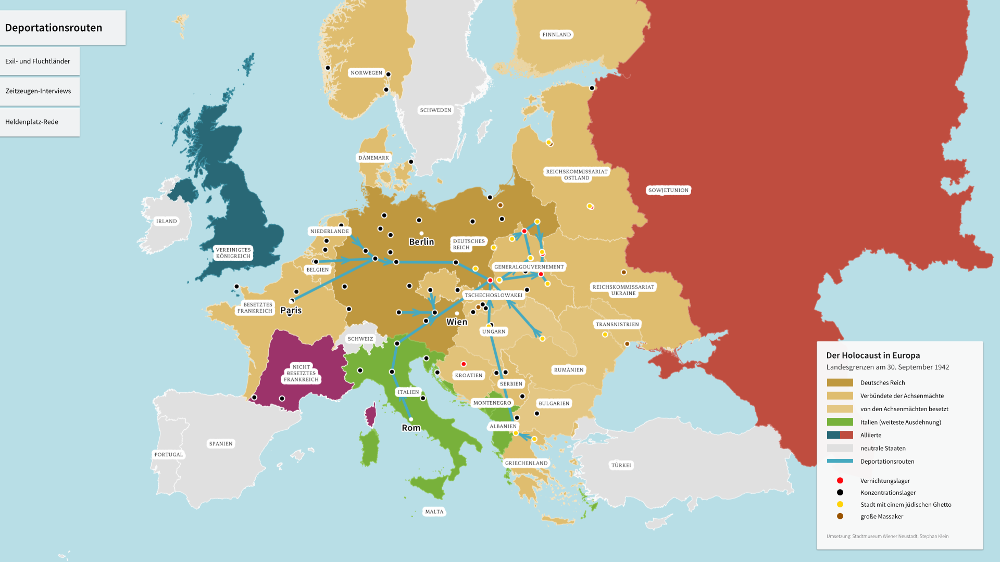
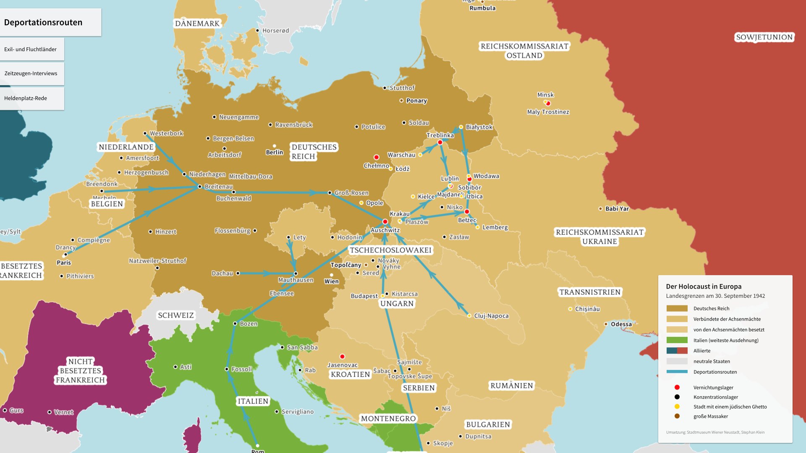
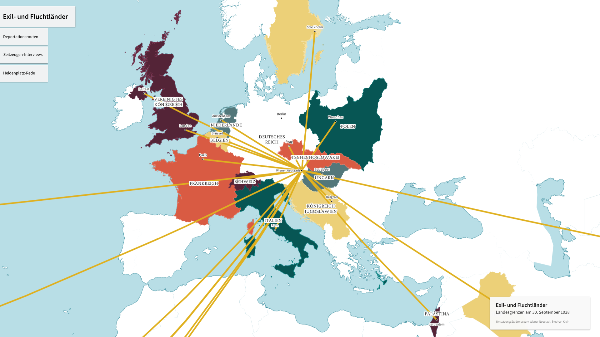
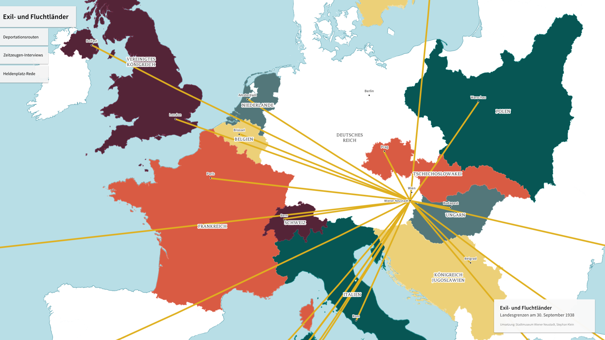
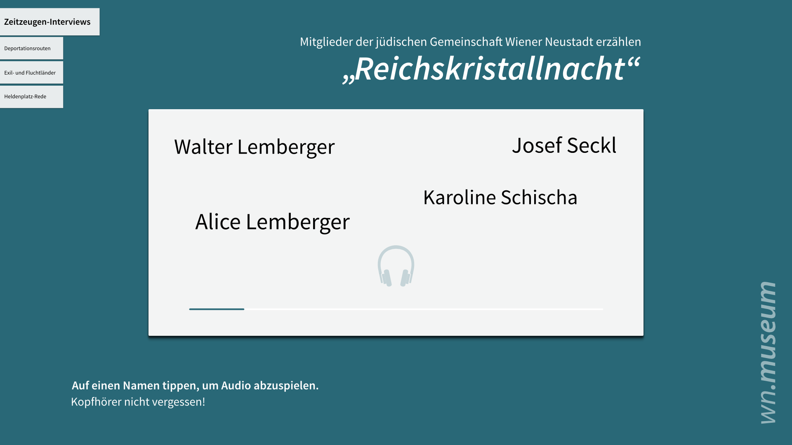

Familienalbum
=============

This is an interactive map display that was created for an exhibition at the
City Museum in Wiener Neustadt. It visualizes the routes on which people were
brought into concentration camps from all over Europe. A second map shows the
destinations to which refugees fled from the Nazi regime. Additionally audio
recordings of refugee diaries can be played within the application.

The display was shown on a touch screen, supports multi touch interaction and is
based on the following technologies:

* processing
* UnfoldingMaps
* TUIO

Note that this repository does not contain the actual recordings which cannot be
made public at this point. Please contact the
[City Museum of Wiener Neustadt](http://stadtmuseum.wiener-neustadt.at) for any
concerns regarding the exhibition.

Building
--------

Just run the gradle wrapper: `./gradlew run` (or whatever is correct for your
platform). You can generate an executable `jar` file by running the `shadowJar`
task.
